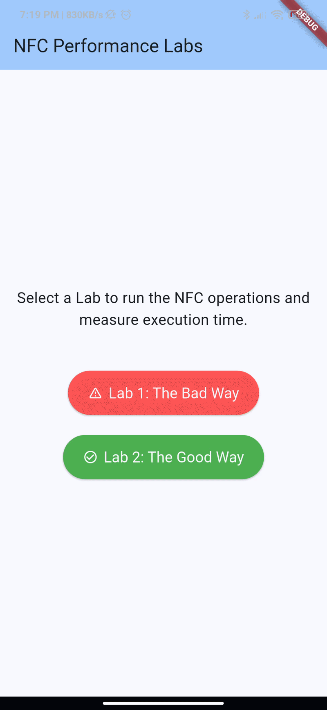
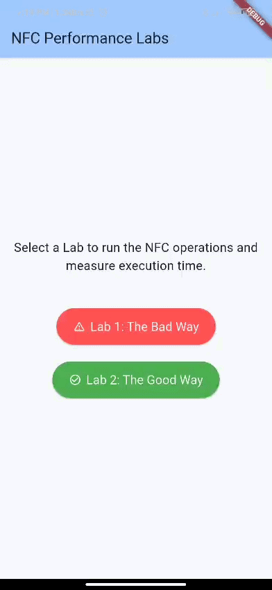
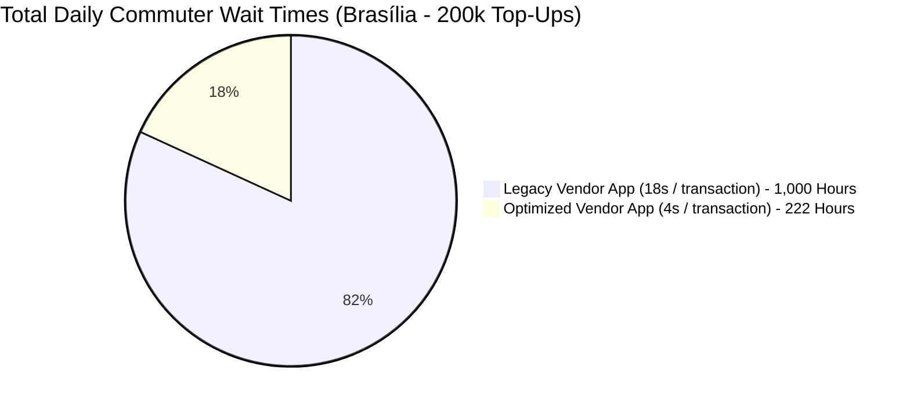
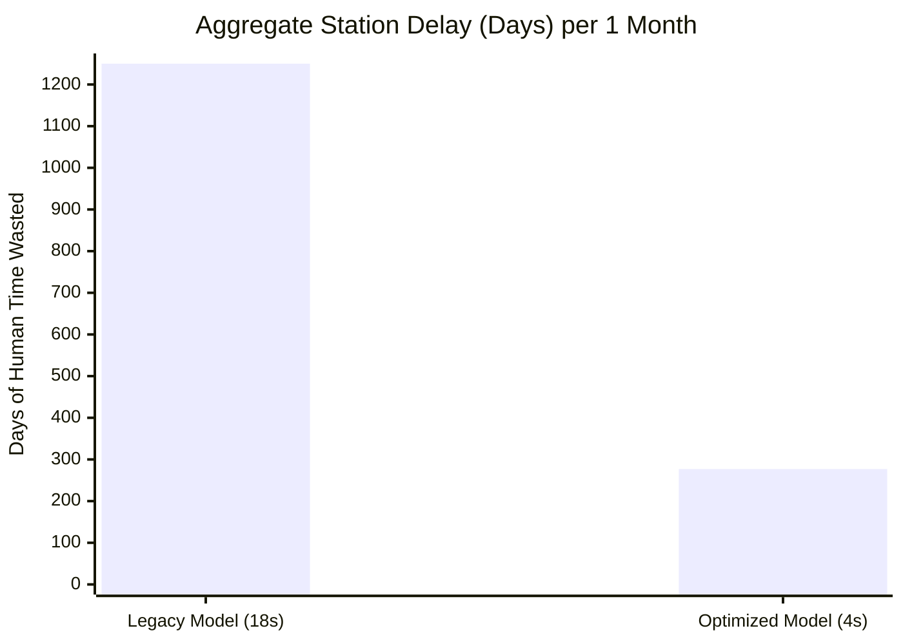

# 🚀 NFC Reading/Writing Performance Improvement Lab

This project demonstrates the monumental impact of architectural design on hardware communication performance in Flutter apps. Specifically, we focus on reading and writing standard NFC cards (like Mifare Classic 4K) using an Android internal card reader via `MethodChannel`.

## 📊 The Problem & The Solution

When integrating hardware (like NFC card readers, Bluetooth peripherals, or external POS systems) into a Flutter application, the asynchronous bridge between Dart (Flutter) and Kotlin (Android Native) introduces micro-delays (`MethodChannel` overhead). When multiplied over a loop of hardware functions, this overhead quickly kills the user experience.

### ❌ The Bad Way (18.0 seconds)
The legacy architecture executed the business logic loop sequentially in Dart. 
1. Dart sends a `detect` command to Native.
2. Native detects the card, returns the serial.
3. Dart sends a `login` command to Native for Sector N.
4. Native logs in, returns success.
5. Dart sends `read` / `write` commands block-by-block.

**Why it fails:** This "ping-pong" approach causes the NFC Radio Frequency (RF) field to occasionally drop lock due to the asynchronous idle gaps between commands. When reading a 40-sector Mifare 4K card, these drops trigger a brute-force hardware polling loop (`amountdetect`). Because Dart is driving the state machine async, the native SDK routinely drops the card lock. This forces massive expensive reconnection retries, making the full read/write cycle take an agonizing **18+ seconds**.

### ✅ The Good Way (4.0 seconds)
The improved architecture delegates the *entire* business loop to the background Native layer.
1. Dart compiles the full list of sectors, keys, and operations into a single structured JSON payload.
2. Dart sends **one single** `MethodChannel` call (`writeAll` / `readAll`).
3. Kotlin executes the detect -> login -> read/write iterating loop robustly in a tight Native `CoroutineScope`.

**Why it wins:** The native OS maintains a constant, uninterrupted lock on the NFC RF field. Reconnection drops are completely eliminated. Furthermore, trailing unsupported sectors (like the unformatted end of a 4K card) are quickly identified and skipped via early-break (`isAllKeys`) logic. The full cycle bypasses the Dart bridge entirely, completing in just **~4 seconds**.

---

## 🌎 Real-World Impact: The Brasília Public Transit Top-Ups

An improvement from 18s to 4s (a 14-second delta) is fantastic for an individual user, but what happens when deployed at a massive scale? Let's model the public transit system in a major metropolitan city like **Brasília** (population ~3 million), specifically looking at **Point-of-Sale (POS) Top-Up Kiosks and Vendor Apps** that sell transit credits and write them to Mifare cards.

Assuming just 200,000 citizens top-up or buy credits for their NFC transit cards every day at stations or authorized vendors:

#### The Math:
- **Legacy System:** 200,000 top-up transactions × 18s = 3,600,000s = **1,000 hours** spent frozen at the vendor kiosks every single day.
- **Optimized System:** 200,000 top-up transactions × 4s = 800,000s = **222 hours** spent writing credits to cards.

**Conclusion:** By migrating the NFC polling logic down to the native Kotlin layer in the vendor application, you save the citizens of Brasília approximately **778 hours (or 32 entire human days) of waiting in line, *every single day*.** At high-traffic hubs during rush hour, an 18-second freeze while a vendor app struggles to write credit to a single card creates massive bottleneck queues extending out the station. A 4-second top-up keeps the line moving fluidly, drastically improving vendor throughput.

---

## 🗂️ Code Walkthrough

| File | Role |
|------|------|
| [`android/.../MainActivity.kt`](android/app/src/main/kotlin/com/example/nfc_reading_writing_improvement/MainActivity.kt) | Kotlin native layer — simulates both the chatty (Lab1) and batched (Lab2) hardware flows |
| [`lib/nfc/atlas_mobile_plugin_card_lab1.dart`](lib/nfc/atlas_mobile_plugin_card_lab1.dart) | MethodChannel abstraction for Lab1 — one call per hardware command |
| [`lib/nfc/nfc_service_lab1.dart`](lib/nfc/nfc_service_lab1.dart) | Lab1 business logic — Dart drives the detect → login → read/write loop |
| [`lib/nfc/nfc_service_lab2.dart`](lib/nfc/nfc_service_lab2.dart) | Lab2 business logic — single batch call delegates the entire loop to Kotlin |
| [`lib/labs/lab1_screen.dart`](lib/labs/lab1_screen.dart) | UI for the bad flow (~18s) |
| [`lib/labs/lab2_screen.dart`](lib/labs/lab2_screen.dart) | UI for the optimized flow (~4s) |

---

## 🧠 Core Lessons Learned

1. **Avoid Chatty Bridges:** Never use a `MethodChannel` to execute a tight loop or step-by-step state machine if it interacts with time-sensitive hardware.
2. **Native Batching:** Package your commands into a single comprehensive data payload, send it to Native once, and let the Native background layer do the heavy iteration.
3. **Hardware Locking Protocols:** RF fields and hardware sockets require continuous engagement. Polling them via an async bridge introduces micro-halts that cause the hardware to assume the sequence has ended. This forces expensive, physical `.detect()` reconnect recoveries.
4. **Early Exit Optimization:** Always account for protocol edge-cases natively (like Mifare 4K trailing empty sectors) so the hardware logic can `.break` execution loops instantly rather than waiting for Dart to figure out what went wrong.
